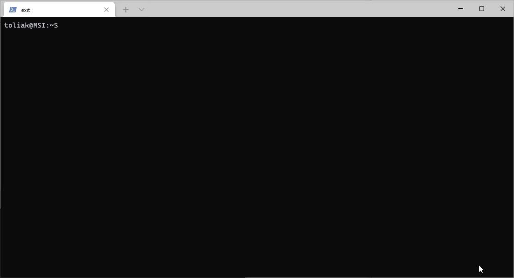
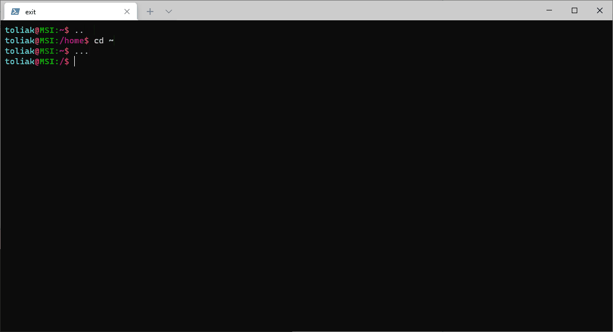

**DEPRECATED.**

Project now is a part of [MakeConfigurationEasier](https://github.com/Toliak/MCE)

# 🎁 Make Linux Easier

**Make you Linux easier**

Common utilities to make Linux & Terminal more convenient

# 🌟 Features

- 🧱  [Oh My ZSH](https://caffeinedev.medium.com/customize-your-terminal-oh-my-zsh-on-ubuntu-18-04-lts-a9b11b63f2)
  - 🗜 [PowerLevel 10k](https://github.com/romkatv/powerlevel10k)
  - 🔬 [ZSH syntax highlighting](https://github.com/zsh-users/zsh-syntax-highlighting)
- ⌨ [Ultimate VIM](https://github.com/amix/vimrc)
- 😲 [Oh My TMUX](https://github.com/gpakosz/.tmux)
- 🛠 Auto-installation for `tmux`, `zsh`, `vim`, `git` (Debian and Arch only)

# 📄 How to install

```console
export MAKE_LINUX_EASIER_PATH="$HOME/.local/share/MakeLinuxEasier" && \
git clone https://github.com/toliak/MakeLinuxEasier --depth 1 $MAKE_LINUX_EASIER_PATH && \ 
$MAKE_LINUX_EASIER_PATH/install.sh $MAKE_LINUX_EASIER_PATH
```

# 📺 Examples and demos

## Installation


## Bash



## Zsh and Vim

After installation, use `zsh` to enter ZSH.

Command to set up `zsh` to be the default terminal:

```console
chsh -s $(which zsh)
```


